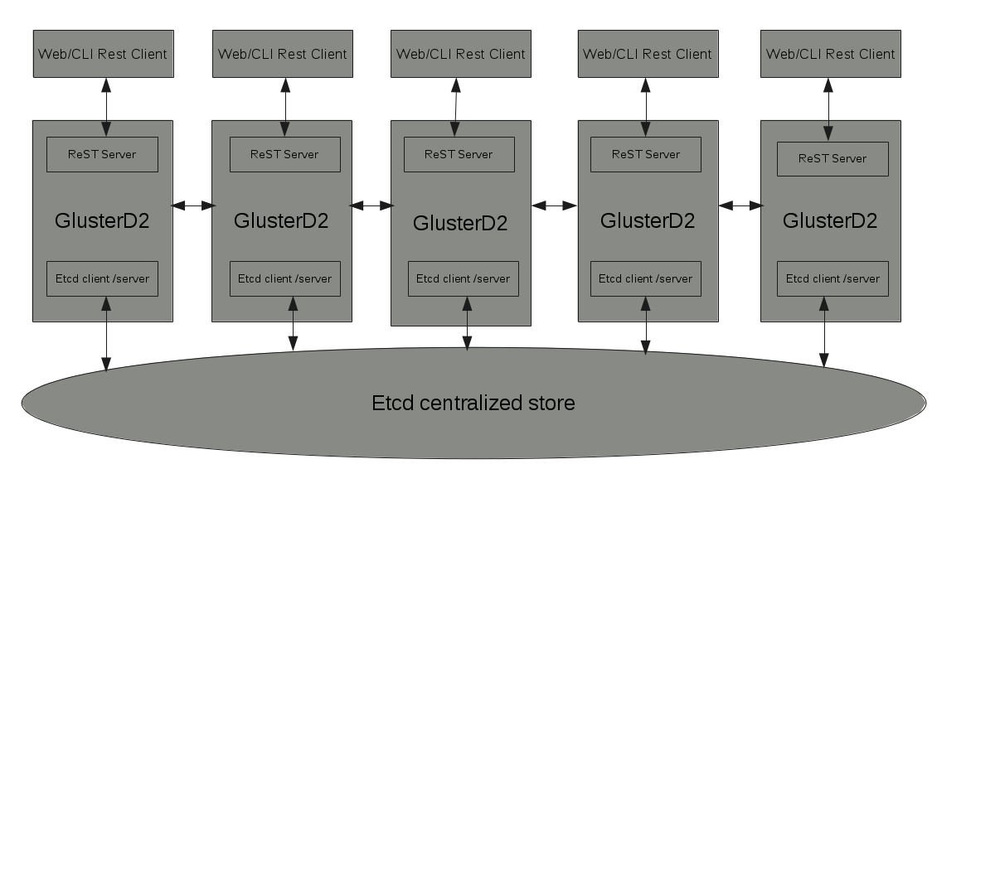

# GlusterD 2.0 Design Document

This document gives a high level overview of the GlusterD-2.0 design. The GlusterD-2.0 design is being refined as we go along, and this document will be updated along the way.

## Why GlusterD-2.0

Gluster has come a long way being the POSIX-compliant distributed file system in clusters of small to medium sized clusters (10s-100s). Gluster.Next is a collection of improvements to push Gluster's capabilities to cloud-scale (read 1000s of nodes).

GlusterD-2.0, the next version of native Gluster management software, aims to offer devops-friendly interfaces to build, configure and deploy a 'thousand-node' Gluster cloud.

## GlusterD 1.0 limitations

Following are the different categories of limitation the current form of GlusterD has.

### Nonlinear node scalability

GlusterD internal configuration data be it membership data or configuration data is replicated across all the nodes and each node maintains the state of its own and all of its peers. This requires the use of a n^2 heartbeat/membership protocol, which doesn’t scale if the cluster forms thousands of nodes.

### Code maintainability & feature integration

Non trivial effort is involved in adding management support for a new feature. Any new feature needs to hook into GlusterD codebase and this is how GlusterD codebase grows exponentially and it becomes difficult to maintain at the same point of time.

## Architectural Overview



The core of GD2 is the centralized store. GD2 will maintain the cluster configuration data, which includes peer and volume information, in a central store instead of maintining it on each peer. It is planned to use [etcd](https://coreos.com/etcd/) to provide the centralized store. etcd servers will only run on a subset of the cluster, tentatively being called the monitor cluster. All other nodes of the cluster will be clients of the monitor cluster.

GD2 will also be a native ReST server, exposing cluster management interfaces via a HTTP ReST API. The CLI will be rewritten as a ReST client which uses this API.

## ReST API

The main management interface with GD2 will be a HTTP ReST interface. APIs will be provided for the management of peers, management of volumes, local-GlusterD management, monitoring (events) and long-running asynchronous operations.

More details on the ReST-API can be found at [[ReST-API]] (_note that this is still under active development_).

### Gluster CLI

The CLI application will be a ReST Client application talking over HTTP ResT interfaces with GD2. The CLI will support GlusterFS 3.x semantics, with changes as appropriate to fix some known issues.


## Centralized store

The central store is the most important part of GD2. The central store will provide GD2 with a centralized location to save cluster data, and have it accessible from the whole cluster. The central store helps avoid the complex and costly transactions in use now. We choose to use an external, distributed-replicated key-value store as the centralized store instead of implementing a new central store framework in GD2. [etcd](https://coreos.com/etcd/) and [consul](https://www.consul.io) are two of the stores in consideration.

### Cluster topography with centralized store

Only a subset of the larger GD2 cluster will be used for serving the centralized store, and remaining cluster will be clients of this sub-cluster. This makes the GD2 cluster a two-tiered cluster.

### Bootstrapping and managing the centralized store

The centralized stores needs to be bootstrapped and managed by GD2. Bootstrapping the central requires choosing the nodes to be used as servers. A discussion on how to do this happened [here](https://www.gluster.org/pipermail/gluster-devel/2015-September/046740.html).

The summary of the discussion is that,
- each GD2 will manage a private instance of it's own store server
- on startup every GD2 will start the store in single-node mode
- At the time of cluster expansion, the GD2 admin will decide whether the new node will be acting as a central store server or client based on an option called "join", if its true then the new node will start acting as one of the central store server otherwise it will be a client.
 - if the probed node is a central-store server, GD2 will shutdown its single-node store, and restart and add the store server to the store cluster.
 - if the probed node is not a central-store server, GD2 will shutdown its single-node store and establish a client connection to the store cluster.

The mechanisms of promotion and demotion of the nodes in the store cluster are still under discussion.


## Transaction framework

The transaction framework will ensure that a given set of actions will be performed in order, one after another, on the required peers of the cluster.

The new transaction framework will be built around the central store. The new transaction framework will have 2 major differences to the existing frameworks,
1. actions will only be performed where required, instead of being done across the whole cluster
2. final committing of the results into the store will only be done by the node (be it a client or server) where the transaction was initiated

The above 2 changes will help keep the transaction framework simple and fast.

More details can be found at [[Transaction-framework]].

## RPC communication

GD2 is going to implement a new cross language RPC framework using [protobuf](https://github.com/google/protobuf). A PoC golang package has been already implemented [here](https://github.com/kshlm/pbrpc). This will be used in communication between GlusterD and GlusterD/Glusterfsd deamons. Clients to bricks and vice versa will still follow the old way of xdr based sun rpc implementation. 

GD2 is going to have the RPC hierarchy in the following manner
```
GD2
|       |- client
|- rpc -|- server
|       |- services

server/ -> would contain the code necessary to create and manage a listener and methods to register services
client/ -> would contain code necessary to establish and manage client connections and methods to send requests
services/ -> would contain the actual services. The services and the handler functions would be defined here
```

## Feature pluggability

To ease integration of GlusterFS features into GD2 and to reduce the maintenance effort, GD2 will provide a pluggable interface. This interface will allow new features to integrate with GD2, without the feature developers having to modify GD2. This interface will mainly be targetted for filesystem features, that wouldn't require a large amount of change to management code. The interface will aim to provide the ability to,

- insert xlators into a volume graph
- set options on xlators
- define and create custom volume graphs
- define and manage daemons
- create CLI commands
- hook into existing CLI commands
- query cluster and volume information
- associate information with objects (peers, volumes)

The above should satisfy most of the common requirements for GD2 plugins.

The actual design on the plugin interface is yet to begin.

### Improving logging

Improvements to logging in GD2 is a crucial, to better support the scale expected. GD2 will use structured logging to help improve log readability and machine parseability. Structured logging uses fixed strings with some attached metadata, generally in the form of key-value pairs, instead of variable log strings. Structured logging also allows us to create log contexts, which can be used to attach specific metadata to all logs in the context. Using log contexts and transaction-ids/request-ids allows us to easily identify and group logs related to a specific transaction or request.

The current PoC of GD2 uses [logrus](https://github.com/Sirupsen/logrus), structured logger for Go.


## Other improvements

GD2 also aims to improve the below.

### Better op-version management

Operating version (or op-version) is used to prevent troubles caused by running heterogeneous (nodes running different versions of glusterfs) clusters. It currently does not have clear guidelines on how it is supposed to be used, leading to inconsistent usage and problems. GD2 will set clear guidelines on how op-versions are supposed to be used, and provide suggested patterns to effectively use op-versions.

### Developer/User documentation

More focus will be given on improving the documentation for both users and developmeners. GD2 code will follow Go documentation practices and include proper documentation inline. This documentation can be easily extracted and hosted using the `godoc` tool.

## Upgrades & Backward Compatibility

As GD2 moves to a new store format and a new transaction mechanism, rolling upgrades from and backwards compatiability with 3.x releases will not be possible. Upgrades will involve service disruption.

Support will be provided for the migration of older configuration data to GD2, possibly in the form of helper scripts.

A detailed discussion on this can be found [here](http://www.gluster.org/pipermail/gluster-devel/2015-October/046866.html).

