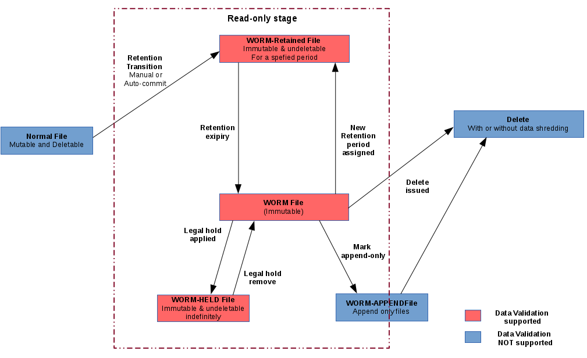
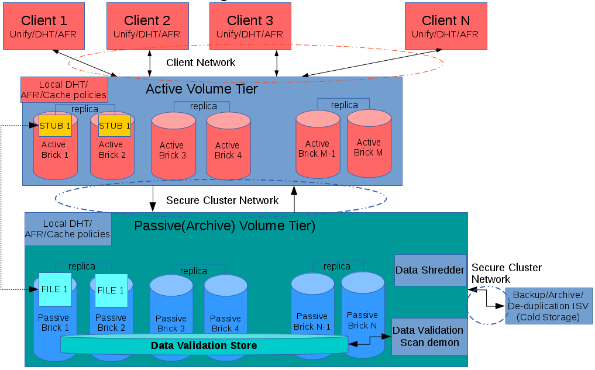
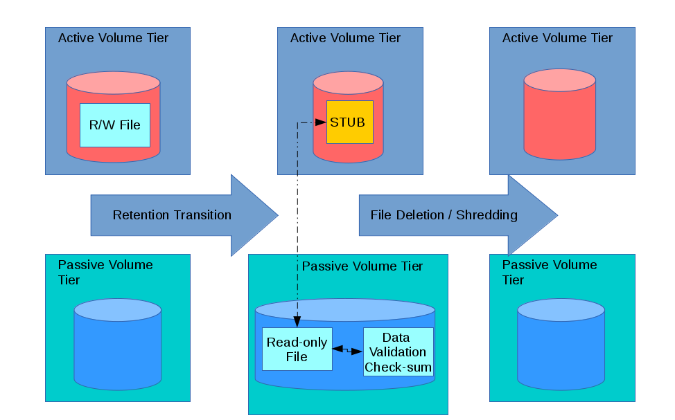

Feature
-------
Gluster Compliance/Archive

Summary
-------

This feature is about having WORM-based compliance/archiving solution in glusterfs. It mainly focus on the following 
- ##### Compliance:
   Laws and regulations to access and store intellectual property and confidential information.
- ##### WORM/Retention:
   Store data in a tamper-proof and secure way & Data accessibility policies
- ##### Archive:
  Storing data in effectively and efficiently & Disaster-Recovery solution

  To address the the above we are proposing the following in glusterfs 
  - Write Once Read Multiple (WORM) File System
  - WORM Data Maintenance
  - WORM based Data Tiering

Detailed Description
--------------------
#### Write Once Read Multiple (WORM) File System
  - ##### WORM/Retention FS :
    A file-system that supports immutable(read-only) and undeletable files. Each file have its own worm/retention attribute.

  - ##### WORM/Retention transition:
    Methods of making a file immutable or non-delete-able or both
    - ###### Manual POSIX command :
       Using POSIX command chmod (-w or 444 or equivalent mode.
    - ###### Automatic Retention Transition (Auto-commit) :
      Dormant Files will be converted into WORM files based on Auto-commit Period
      - ###### Lazy Auto-commit:
        IO Triggered Using timeouts for untouched files. The next IO will cause the transition.
      - ###### Scheduled Auto-commit:
        Scan Triggered Using timeouts for untouched files. The next scheduled namespace scan will cause the transition. 
        CTR DB via **libgfdb** can be used to find files that have not changed. This can be verified with stat of the file.

      - ###### Retention Profiles/Policies:
        Configurable Policies that guide the WORM/Retention behavior. Contains Default Retention Period, Auto-commit Period, Mode of Retention (Enterprise/Compliance),Auto-Deletion, Data Shredding Mode. Its can be on a Volume Level or Directory/Share Level 

      - ###### Backup ISV Support:
        Exposing the WORM/Retention attributes of a file for Backup.

      - ###### Data Storage Options:
        Focus on Data Protection, Storage Efficiency and Data Security for Read-only data
        - Replication AFR (Original format) 
        - Erasure-Coding (stripe with parity)
        - Encryption (Encrypted format with key)

    ##### Life cycle of a file in a WORM/Retained filesystem

    

#### WORM Data Maintenance

  - ##### Data Validation/Bitrot Protection:
    Ensuring the data validity of Immutable/Read-only file and safe guarding from bit-rot or any other data corruption.
    - ##### Checksum Generation:
      Options on checksum eg:: MD5, SHA1 or SHA256 etc. A self validating checksum store, which resides on the namespace. 

  - ##### Data Validation Scan:
      Scheduled scan of Immutable/Read-only files checking for data corruption.
    - ##### Error Detection/Report:
      Data Validation scan reports in XML or CSV format
    - ##### Error Correction/Heal:
      Healing the corrupted data if possible.

  - ##### Data Shredding Option: 
    - ##### Actual Data Shredding :
      Before deleting read-only files do data shredding, so that the contents are not recoverable. Options on algorithms can be provided.
    - ##### Encrypted Data:
      Normal Delete will follow key shredding. This will optimize the data shredding.

#### WORM based Data Tiering

  - ##### WORM Volume pairs for File-Tiering
    - ##### Active Volume Tier
        - Active IO (Read and Write)
        - Faster but Expensive Storage Media (SSD or Faster RPM Disks)
        - Directly connected to the IO Clients
    - ##### Passive(Archive) Volume Tier
        - Passive(Only Read accessed) IO
        - Slower but Cheaper Storage Media 
        - Not Connected to Clients
    - Both the Active and Passive volume tier can belong to two different clusters or the same cluster
 
    - ##### File Stubbing on Retention Transition :
      On Retention Transition (Manual or Auto-commit) data will be purged from the Active Volume Tier and moved to Passive Volume Tier, just leaving behind a file-stub. The Data will be Read-only and adhere to the Retention Policy.

    - ##### Local Distribute/Replication/Cache Policies:
        Active/Passive Volume tiers will have their  own suitable DHT, AFR, Unify, NSR, Cache etc policies/setting

    - ##### Shared Retention Profile:
        Both the Active and Passive Volume Tier will share common retention profile 

    - ##### Data Validation on Passive Volume Tier
        - Data Validation Scans
        - Detection and Correction
        - Data Validation Store

    - ##### Re-Hydration of Stub :
        The Stub will be Re-Hydrated i.e Data will be moved to Active Volume Tier, on frequent access of data, bases on configurable policies. Just a read-only copy on the Active Volume Tier. Again the frequency of access and heat can be got from CTR Xlator via ***libgfdb***.

Owners
------
- Joseph Fernandes <josferna@redhat.com>
- Karthik Subrahmanya <ksubrahm@redhat.com>

Current status
------
Proposal phase : POC

Benefit to GlusterFS
------
* Glusterfs will have more realistic Compliance & Archival solution 
* Glusterfs HSM (Hierarchical Storage Management)

Scope
------
1. Implement WORM-Retention Semantics in GlusterFS using the WORM Xlator
2. Integrate WORM-Retention with Bitrot with WORM-Retention Feature for Data Validation
3. Help in implementing Control of atime,mtime,ctime [3], as its a requirement for us
4. Tiering based on Compliance

Nature of proposed change
-------------

1. Implement WORM-Retention Semantics in GlusterFS using the WORM Xlator
2. Integrate WORM-Retention with Bitrot with WORM-Retention Feature for Data Validation
3. Help in implementing Control of atime,mtime,ctime [3], as its a requirement for us
4. Tiering based on Compliance

Implications on manageability
-------------
<Glusterd, GlusterCLI, Web Console, REST API>

1. Few vol set commands for setting retention profiles.

Implications on presentation layer
-------------

<NFS/SAMBA/UFO/FUSE/libglusterfsclient Integration>

TBD

Implications on persistence layer
-------------
<LVM, XFS, RHEL ...>
None

Implications on 'GlusterFS' backend
-------------
None that we can see

Modification to GlusterFS metadata
-------------
1. Per file worm retention state + retention period xattr
2. on the root of the vol the retention profile as xattr.

Implications on 'glusterd'
-------------

<persistent store, configuration changes, brick-op...>

1. Few vol set commands for setting retention profiles.

How To Test
-------------

<Description on Testing the feature>

TBD As the design gets in detail.

User Experience
-------------

<Changes in CLI, effect on User experience...>

TBD As the design gets in detail.

Dependencies
-------------

<Dependencies, if any>

Documentation 
-------------

<Documentation for the feature>

TBD

Status
-------------

POC

Comments and Discussion
-------------

<Follow here>

